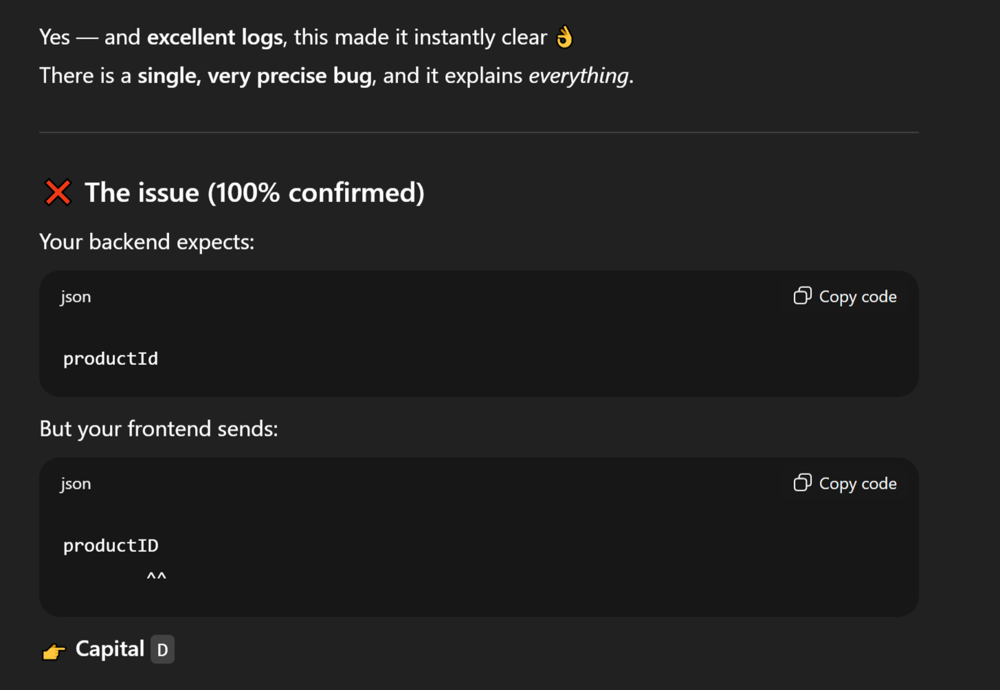

# 🎁 Sorpresa — Angular Frontend
_¡Porque toda sorpresa merece un frontend fluido.!_

</br>

---

**Sorpresa** is a modern, single-page mystery shop frontend built with **Angular**, designed to pair seamlessly with the Sorpresa backend API.  
It delivers a smooth shopping experience with guest access, secure checkout, theme switching, and clean SPA navigation — all wrapped in a minimal, user-friendly UI.

> _Sorpresa_ means **“surprise”** in spanish — and that’s exactly what every order is 😉

</br>

---

## ✨ Features

- 🛍️ **Product Listing & Details**
  - Browse mystery products with images and descriptions
  - Cloudinary-hosted images for fast delivery

- 🛒 **Shopping Cart**
  - Add / remove items
  - Quantity control
  - Real-time total calculation

- 👤 **Guest Cart Access**
  - Users can build a cart before logging in

- 🔐 **JWT Authentication**
  - Login & Register
  - Token-based auth stored securely
  - Auth interceptor for API requests

- ✅ **Protected Checkout**
  - Checkout is accessible only to authenticated users
  - Order placement with validation

- 🌗 **Dark / Light Mode**
  - Theme toggle with persistent preference

- 🚀 **SPA Navigation**
  - Fast client-side routing

</br>

---

## 🛠️ Tech Stack

### Frontend
- **Angular 20.3** (Standalone components)
- **TypeScript 5.9**
- **RxJS 7.8**
- **Angular Router**
- **JWT Interceptor**
- **CSS Variables** for theming

### Backend (Linked Project)
- Node.js + Express  
- PostgreSQL  
- JWT Authentication  

🔗 **Backend Repo:**  
👉 https://github.com/Janaherself/sorpresa

🔗 **Live API:**  
👉 https://sorpresa-api.onrender.com

</br>

---

## 📦 Project Structure (Simplified)

src/</br>
├─ app/</br>
│ ├─ components/</br>
│ │ ├─ cart/</br>
│ │ ├─ header/</br>
│ │ ├─ login/</br>
│ │ ├─ product-details/</br>
│ │ ├─ product-list/</br>
│ │ ├─ register/</br>
│ │ └─ success/</br>
│ ├─ interceptors/</br>
│ ├─ models/</br>
│ ├─ services/</br>
│ ├─ app.config.ts</br>
│ └─ app.routes.ts</br>
├─ index.html</br>
├─ main.ts</br>
├─ server.ts</br>
└─ styles.css</br>

</br>

---

## ⚙️ Setup & Installation

- You can visit the site and start shopping immediately through **https://sorpresa-vz4i.onrender.com**!

- Alternatively, you can run the app locally on your machine as follows:

#### 1️⃣ Clone the repository
```bash
git clone https://github.com/Janaherself/sorpresa-frontend.git
cd sorpresa-frontend
```

#### 2️⃣ Install dependencies
```bash
npm install
```

#### 3️⃣ Run the app
```
ng serve --port 4200
```
The app will be available at:
```
http://localhost:4200
```

> _because I'm using a free hosting service to host the API, calling it could take a minute or two - I advise you to be patient 😄_

</br>

---

## 🧠 A Small (But Real) Dev Story

At one point, the **“Place Order”** button refused to work.

- ✔️ The backend endpoint worked perfectly  
- ✔️ The request worked in Postman  
- ❌ The frontend kept failing  

After **hours of debugging**, console logging, and questioning life choices…  
ChatGPT spotted the issue in one prompt, which turned out to be:



🧩 The API expected one thing, the frontend sent another.  
Once fixed, everything worked instantly.

**Moral of the story:**  
> _When Postman works but the UI doesn’t, trust the payload._  

</br>

---

## 🔒 Authentication Notes
- JWT token is attached automatically using an HTTP interceptor

- Protected routes (like post api/orders) are secured using route guards

- Guest users can browse products and manage the cart, but must log in to place an order

</br>

--- 

## 🌱 Future Improvements
- Order history page

- Improved animations

- Payment gateway integration

- Better error & empty states

- Admin dashboard (who kmows 👀)

</br>

--- 

## 🙌 Acknowledgments
- Built with persistence, debugging, and coffee ☕

- Special thanks to console.log, Postman, Github Copilot, and ChatGPT for being reliable debugging partners

</br>

---

## 🧑‍💻 Author
Jana Abusaa
Backend & (Full-Stack Developer) to be!

> If you enjoyed this project or learned something from it — ⭐ the repo!

